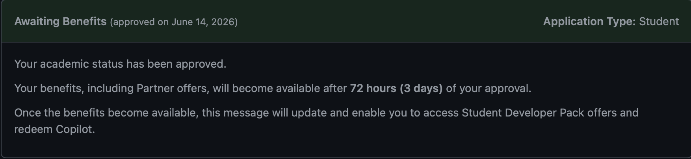

# Introduction

::: {.callout-note}
This reflection summarizes my experience learning Positron, exploring AI-assisted coding tools, and preparing to use GitHub Copilot throughout the course.
:::

Positron is a modern data science IDE that supports R, Python, Quarto, and AI-assisted development. This report reflects on my experience using Positron and exploring its capabilities.

# Prompt 1: What do you like about Positron compared with RStudio?

> Based on what you learned from Step 1 and Step 3, what do you like about Positron compared with RStudio?

I like Positron because it combines many of the features I already know from RStudio with a more modern interface. The activity bar makes navigation easier, and the layout feels similar to Visual Studio Code. I also like that Positron supports both R and Python within the same environment. Since machine learning and data science often use multiple programming languages, this flexibility will be useful throughout the course. I also appreciate that Positron has built-in support for AI assistants and modern development tools.

# Prompt 2: Describe the various ways you can use AI inside Positron.

> Describe the various ways you can use AI inside Positron. Some are free while others are not.

AI can be used inside Positron in several ways. It can generate code suggestions, explain programming concepts, help debug errors, create sample datasets, and assist with data visualization. AI tools can also summarize code and provide alternative approaches to solving problems. Some AI services are free, while others require paid subscriptions. These tools can improve productivity and help users learn programming concepts more efficiently.

# Prompt 3: Which AI tools have you installed or set up?

> Which AI tools have you installed or set up? Which AI tools did you find beneficial for you?

I created a GitHub account and successfully applied for GitHub Education. I now have access to the GitHub Student Developer Pack, which includes GitHub Copilot and other educational benefits. I believe GitHub Copilot will be beneficial because it can provide code suggestions, explain unfamiliar functions, and improve productivity when learning R, Quarto, and machine learning concepts. AI-assisted coding tools can also help me learn new workflows more efficiently and reduce the time spent searching for syntax and examples.

# Prompt 4: Play with it and do you find it helpful or distracting?

> Play with it and do you find it helpful or distracting? Please elaborate.

I now have access to GitHub Copilot through the GitHub Student Developer Pack. Based on my initial experience, I find Copilot helpful because it can generate code suggestions, explain functions, and help troubleshoot programming problems. It can reduce the time spent searching for syntax and examples, making it easier to learn new programming concepts and complete coding tasks efficiently. However, I also recognize that AI tools can become distracting if users rely on them too heavily without understanding the underlying concepts. For that reason, I plan to use Copilot as a learning aid while continuing to verify and understand the code it generates. Overall, I believe GitHub Copilot will be a valuable tool throughout this course.

# Prompt 5: GitHub Education Approval

> Apply for GitHub Copilot and take a screenshot showing you were accepted into the education program.

I successfully applied for GitHub Education and was approved for the GitHub Student Developer Pack. This approval provides access to GitHub Copilot and other educational resources that support learning and software development. The screenshot below shows my approved academic status.

# Prompt 6: GitHub Pages Publication

> Publish this report to GitHub Pages and provide a URL to the GitHub Pages for the report.

GitHub Pages URL:

**To be added after publication**

::: {.callout-tip}
GitHub Pages is a website hosting service that publishes rendered HTML pages. It is different from a GitHub repository, which stores project files and version history.
:::

# Additional Reflection

## Benefits of AI-Assisted Coding

- Faster code generation
- Easier debugging
- Improved learning of new functions
- Assistance with documentation
- Productivity improvements

## Comparison of IDEs

| Feature | RStudio | Positron |
|----------|----------|----------|
| R Support | Yes | Yes |
| Python Support | Limited | Strong |
| AI Integration | Limited | Built-in |
| Modern Interface | Moderate | Strong |

# Conclusion

Overall, Positron appears to be a powerful development environment for data science and machine learning. Its support for R, Python, Quarto, and AI-assisted development tools makes it well suited for the projects and assignments in this course. I look forward to using Positron and GitHub Copilot throughout the semester.

[^1]: GitHub Copilot is available through the GitHub Student Developer Pack after approval.